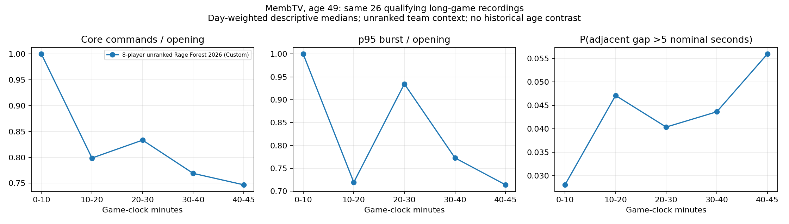
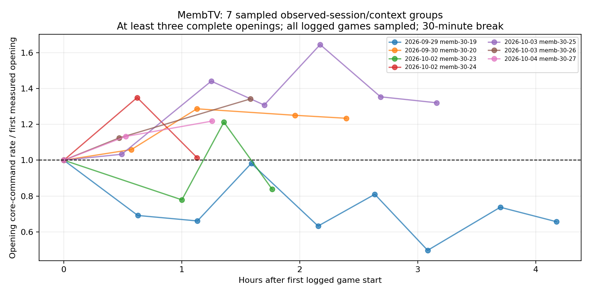

# MembTV extension: recent command behavior and replay availability

MembTV is added as a separately labeled cohort. His July 22, 1977 birth date makes him 49 during these recordings. No historical replay baseline was recovered, so this extension does **not** measure an age 42–49 trajectory.

Identity sources: [Liquipedia](https://liquipedia.net/ageofempires/MembTV) and [AoE2Insights profile 196407](https://www.aoe2insights.com/user/196407/). The profile lists RM 1v1 rating 1810 and 4,572 RM 1v1 matches. Retrieved Companion ranked logs end May 29, 2026; a displayed rating does not establish current ranked activity. Indexed match totals differ across source snapshots and are not replay availability counts.

## Recovered cohort

- Frozen sample: newest 60 all-mode games in six cached pages (120 logged games), selected before calculating command outcomes. 56 were downloaded; 54 passed analysis eligibility, with 2 aborted recordings under one game minute excluded. Four recent download attempts returned HTTP 404. Three additional latest-ranked probes returned HTTP 404.
- Verified replay dates: 2026-09-27T20:02:16.000Z through 2026-10-04T10:06:19.000Z.
- Identity, timestamp agreement, source hashes, body endpoints and synchronization clocks were checked for every included recording. 51/54 contain a POSTGAME operation; missing POSTGAME is marked partial in paired long-game tables.
- Recent games are kept by their logged player count, mode and map context. They are not pooled with DauT, TheViper or TaToH 1v1 periods.
- The original 82-field dictionary is retained. 82 fields have at least one whole-replay value; missing per-game fields remain blank. The tatoh_ prefix denotes the original legacy definition, now also applied to Memb, not a TaToH observation.
- The combined archive now contains 152 verified player-game observations. The original 98-observation analyses remain identifiable and unchanged.

## Opening and whole-replay behavior

Each day has equal total weight and its games share that weight. Medians describe command behavior, not cognitive capacity.

| Context | Window | Games / days | Core commands / nominal min | Approximate deduplicated rate |
| --- | --- | --- | --- | --- |
| 6-player rm_team Oasis | first 10 game minutes | 1 / 1 | 55.4 | 42.1 |
| 6-player rm_team Oasis | whole available replay | 1 / 1 | 49.6 | 33.9 |
| 8-player rm_team Nomad | first 10 game minutes | 1 / 1 | 56.3 | 36.2 |
| 8-player rm_team Nomad | whole available replay | 1 / 1 | 51.8 | 29.4 |
| 8-player unranked Rage Forest 2026 (Custom) | first 10 game minutes | 52 / 8 | 58.5 | 31.4 |
| 8-player unranked Rage Forest 2026 (Custom) | whole available replay | 52 / 8 | 50.7 | 29.1 |

## Long-game pairing

26 recordings reach 45 available game minutes. The same qualifying recordings contribute all plotted phases. Each late/opening contrast is calculated per game before equal-day weighting. No earlier-period contrast is available.

| Context | Late interval | Games / days | Core late/opening | p95 burst late/opening | Long-gap delta, percentage points |
| --- | --- | --- | --- | --- | --- |
| 8-player unranked Rage Forest 2026 (Custom) | 40+ | 26 / 8 | 0.714 | 0.784 | 2.86 |
| 8-player unranked Rage Forest 2026 (Custom) | 40+ excluding final minute | 26 / 8 | 0.727 | 0.803 | 2.83 |
| 8-player unranked Rage Forest 2026 (Custom) | 40-45 | 26 / 8 | 0.747 | 0.714 | 1.68 |

1 qualifying recording lacks POSTGAME. Excluding partial recordings leaves 25 long games: the fixed late/opening core ratio is 0.747, p95 burst ratio 0.714, and gap-probability change 1.68 percentage points. [Complete-recording sensitivity](complete_long_game_summary.csv).



## Observed sessions

7 primary session/context groups have at least three complete openings, all games in the cached session sampled, and no left-edge log censoring. Session boundaries use **all 120 logged matches**, including unavailable and unparsed games. Gaps over 30 inactive wall-clock minutes define a new session; 15 and 60 minutes are retained as sensitivities. Starts/finishes describe the observed match run, not a verified beginning of the day. Unavailable games can have missing command outcomes and remain counted in observed ordinals.

| Session | Complete openings | First-to-last opening hours | Core last/first | p95 burst last/first | Gap delta, percentage points |
| --- | --- | --- | --- | --- | --- |
| memb-30-27 | 3 | 1.26 | 1.219 | 1.343 | -1.79 |
| memb-30-26 | 3 | 1.58 | 1.342 | 0.968 | -1.72 |
| memb-30-25 | 7 | 3.16 | 1.321 | 1.780 | -2.80 |
| memb-30-24 | 3 | 1.13 | 1.014 | 1.048 | 0.19 |
| memb-30-23 | 4 | 1.77 | 0.838 | 1.168 | 2.34 |
| memb-30-20 | 5 | 2.39 | 1.234 | 1.252 | -1.29 |
| memb-30-19 | 9 | 4.18 | 0.656 | 0.662 | 0.71 |

Across the seven primary sessions, the median final/first opening core-rate ratio is 1.219; five sessions increase and two decrease. The nine-opening run over 4.18 hours ends about 34% below its first opening, but this is one recent run with changing game conditions, not an aging estimate. [Session-break summary](session_summary.csv).



## Availability and interpretation limits

Historical match identifiers were found for December 2020 and October 2022. Two replay endpoints from each period returned HTTP 404, as did the three May 2026 ranked probes. The public 2021 Open Classic tournament archive returned HTTP 403; it was not bypassed. Liquipedia documents historical participation, but participation and casting credits do not establish surviving player replay files. These bounded checks do not prove that no private or community archive exists.

The proposed DE age 42–49 window remains a **potential sampling range**, not observed coverage. The current team-game cohort adds an older, less elite player but does not by itself improve longitudinal identification. Team demands, custom maps, civilization, opponent strength, settings, practice and streaming/casting obligations can change independently of age. Current RM 1v1 Elo cannot be used as the team-game skill or demand covariate.

Equal game-clock windows partially control phase composition but do not measure independent required workload. Rates and gap thresholds use nominal seconds (game seconds / replay speed). Burst p95 uses complete aligned ten-nominal-second bins; opening and fixed late windows have different exposure. Long-gap probability includes all adjacent within-window gaps, including zeros, excludes censored boundary gaps, and uses strictly >5 seconds. Age-up anchors are research requests, not completed age-ups or validated combat phases. Repeated destinations are not automatically wasted commands.

No reaction time, working-memory capacity, compensation, cognitive reserve, onager-dodge success or validated useful state change per command is measured. The new analysis does not run CaptureAge or claim decoded engine-state features. No population significance test or causal aging estimate is reported.

## Tables and reproduction

- [Original 82 per-game traits](original_82_trait_metrics.csv) and [historical coverage table](original_82_trait_coverage.csv).
- [Combined all-player comparison table](all_players_trait_comparisons.csv), preserving original comparisons and adding Memb rows with unavailable historical baselines.
- [Window metrics and request anchors](window_metrics.csv), [paired long-game contrasts](long_game_paired_changes.csv), [long-game summary](long_game_summary.csv).
- [Session opening measurements](session_opening_metrics.csv) and [session comparisons, slopes and break sensitivities](session_comparisons.csv).
- [Replay hashes and inventory](game_inventory.csv), [download ledger](downloads.json), [historical endpoint audit](historical_availability_audit.json), [validation](validation.json), [integration checks](integration_validation.json).
- [Collection](../scripts/fetch_memb.py), [analysis](../scripts/analyze_memb.py), [report/integration](../scripts/report_memb.py). Raw replays may contain public match chat; derived owned commands omit chat and viewlocks.

Run with the existing pinned parser environment and restored Memb release inputs:

```sh
python scripts/analyze_memb.py
python scripts/report_memb.py
```
