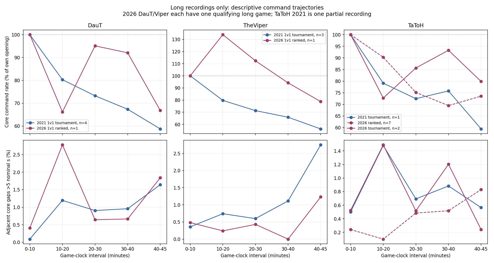
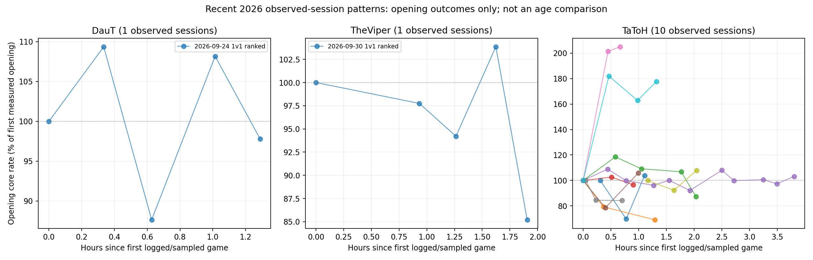

# Long-game and observed-session command trajectories

This extension tests within-game command timing and recent observed-session patterns using the existing 98 verified player-game observations. It does not measure cognitive reserve, normalize independent game-state demand, or establish an aging effect. Whole-game command volume is an inadequate stamina outcome because phase composition and duration differ.

## Design and definitions

- Long-game cohort: recordings with at least 45 available game minutes. The same qualifying games contribute 0–10, 10–20, 20–30, 30–40 and fixed 40–45-minute measurements. This avoids comparing late-game survivors with openings from all short and long games, but selection on reaching 45 minutes remains a confound.
- Opening baseline: each qualifying game's own first ten game minutes. Ratios/differences are computed per game before period aggregation. Each series/session-day receives equal total weight; games share that weight. Game medians and ranges are preserved in CSV.
- Clock: intervals are game-clock minutes. Command rates, ten-second burst bins and five-second gap thresholds use nominal seconds (game seconds divided by recorded speed), matching previous analyses. This is not observed human wall-clock reaction time.
- Burst: p95 of core-command rates in complete, aligned ten-nominal-second bins. Maximum ten-second rate is also reported. Core commands are MOVE, ORDER, BUILD, RESEARCH, DELETE, BUY, SELL and WALL; these rates are not device-input APM. Opening and fixed late intervals differ in length (ten versus five game minutes); p95 reduces, but does not remove, sample-size effects. Maximum bursts are particularly exposure-sensitive.
- Gap probability: number of adjacent within-window core-command gaps strictly greater than five nominal seconds divided by all adjacent gaps, including zero gaps. Boundary gaps are excluded because they are censored. This is distinct from the fraction of window time spent in long command silences, which is stored separately and includes edge intervals.
- Sensitivities: requested 40+ available interval, fixed 40–45 interval, maximum versus p95 bursts, and 40+ with the final available recording minute omitted. A partial recording's endpoint is not a known match endpoint.
- Research anchors: fixed five-minute intervals after Feudal/Castle/Imperial RESEARCH requests, plus the following five-minute interval where available. Requests are not completed age-ups; these are neither validated combat phases nor guaranteed equivalent game states.
- Command footprint: explicit commanded actor IDs, commanded production-building IDs, queue requests and command diversity are recorded as input-side descriptors. They depend on command choices and coverage; they are not independent workload measurements or useful state output. Approximate repeated destination/target pairs are not automatically wasted commands.

## Available long games

| Player | Year | Context | All games | 45+ games | Long-game clusters | Partial long recordings |
| --- | --- | --- | --- | --- | --- | --- |
| DauT | 2011 | 1v1 challenge | 4 | 0 | 0 | 0 |
| DauT | 2012 | team game | 7 | 4 | 2 | 0 |
| DauT | 2021 | 1v1 tournament | 9 | 4 | 2 | 0 |
| DauT | 2026 | 1v1 ranked | 5 | 1 | 1 | 0 |
| TaToH | 2021 | tournament | 1 | 1 | 1 | 1 |
| TaToH | 2026 | ranked | 40 | 7 | 6 | 0 |
| TaToH | 2026 | tournament | 13 | 2 | 2 | 0 |
| TheViper | 2012 | team game | 9 | 6 | 3 | 0 |
| TheViper | 2021 | 1v1 tournament | 5 | 3 | 2 | 0 |
| TheViper | 2026 | 1v1 ranked | 5 | 1 | 1 | 0 |

The 2011 DauT sample has no 45+ recording. Classic 2012 team games are retained as a separate appendix-level comparison; ownership/encoding, team demands and timing resolution prevent a clean comparison with recent DE 1v1 games. TaToH's 2021 recording covers the fixed 40–45 interval, but its variable 40+ result ends at the partial recording cutoff.

## Fixed 40–45 versus the same game's 0–10 baseline

Ratios below are medians of per-game ratios, with equal cluster weights. A ratio below 1 means lower late-window command throughput/burst size. The gap column is an absolute difference in percentage points: positive means more late-window gaps over five seconds. Neither direction alone identifies fatigue, because workload and strategy remain unmeasured.

| Player | Year | Context | Games / clusters | Core-rate ratio | p95 burst ratio | Maximum burst ratio | Long-gap Δ pp |
| --- | --- | --- | --- | --- | --- | --- | --- |
| DauT | 2021 | 1v1 tournament | 4 / 2 | 0.587 | 0.608 | 0.615 | 1.64 |
| DauT | 2026 | 1v1 ranked | 1 / 1 | 0.668 | 0.731 | 0.640 | 1.43 |
| TaToH | 2021 | tournament | 1 / 1 | 0.594 | 0.520 | 0.517 | 0.06 |
| TaToH | 2026 | ranked | 7 / 6 | 0.735 | 0.717 | 0.728 | 0.55 |
| TaToH | 2026 | tournament | 2 / 2 | 0.799 | 0.737 | 0.692 | -0.28 |
| TheViper | 2021 | 1v1 tournament | 3 / 2 | 0.562 | 0.597 | 0.581 | 2.39 |
| TheViper | 2026 | 1v1 ranked | 1 / 1 | 0.788 | 0.896 | 0.893 | 0.75 |



The plots retain the identical long-game cohort throughout. Rates are normalized to each game's own opening; gap probability is shown directly. Lines are descriptive medians, not fatigue-adjusted performance or confidence intervals.

## Requested 40+ interval and endpoint sensitivity

| Player | Year | Context | Late interval | p95 burst ratio | Maximum burst ratio | Long-gap Δ pp |
| --- | --- | --- | --- | --- | --- | --- |
| DauT | 2021 | 1v1 tournament | 40+ | 0.659 | 0.660 | 1.63 |
| DauT | 2021 | 1v1 tournament | 40+ excluding final 60 game seconds | 0.670 | 0.660 | 1.68 |
| DauT | 2026 | 1v1 ranked | 40+ | 0.728 | 0.640 | 2.08 |
| DauT | 2026 | 1v1 ranked | 40+ excluding final 60 game seconds | 0.731 | 0.640 | 1.33 |
| TaToH | 2021 | tournament | 40+ | 0.769 | 1.034 | 0.90 |
| TaToH | 2021 | tournament | 40+ excluding final 60 game seconds | 0.769 | 1.034 | 0.86 |
| TaToH | 2026 | ranked | 40+ | 0.813 | 0.795 | 0.73 |
| TaToH | 2026 | ranked | 40+ excluding final 60 game seconds | 0.813 | 0.722 | 0.66 |
| TaToH | 2026 | tournament | 40+ | 0.729 | 0.724 | 0.67 |
| TaToH | 2026 | tournament | 40+ excluding final 60 game seconds | 0.745 | 0.724 | 0.22 |
| TheViper | 2021 | 1v1 tournament | 40+ | 0.738 | 0.728 | 2.55 |
| TheViper | 2021 | 1v1 tournament | 40+ excluding final 60 game seconds | 0.752 | 0.728 | 2.17 |
| TheViper | 2026 | 1v1 ranked | 40+ | 0.970 | 1.857 | 0.15 |
| TheViper | 2026 | 1v1 ranked | 40+ excluding final 60 game seconds | 0.937 | 1.857 | 0.17 |

## Research-request-aligned windows

The following comparisons hold the relative interval at the first five game minutes after an age-up research request. Completed age-up times and combat status are unknown, and start-age/maps/settings can differ. These are operational anchors, not verified Feudal combat, early Castle or Imperial state equivalence. The full `request_anchor_period_summary.csv` also contains the following five-minute windows, bursts, long-gap probabilities and approximate deduplicated rates.

| Player | Year | Context | Request-relative interval | Games | Clusters | Core commands / nominal min |
| --- | --- | --- | --- | --- | --- | --- |
| DauT | 2021 | 1v1 tournament | Castle request +0-5 min | 8 | 2 | 82.1 |
| DauT | 2021 | 1v1 tournament | Feudal request +0-5 min | 9 | 2 | 80.8 |
| DauT | 2021 | 1v1 tournament | Imperial request +0-5 min | 5 | 2 | 64.9 |
| DauT | 2026 | 1v1 ranked | Castle request +0-5 min | 4 | 1 | 74.4 |
| DauT | 2026 | 1v1 ranked | Feudal request +0-5 min | 5 | 1 | 87.2 |
| DauT | 2026 | 1v1 ranked | Imperial request +0-5 min | 1 | 1 | 75.4 |
| TaToH | 2021 | tournament | Castle request +0-5 min | 1 | 1 | 85.5 |
| TaToH | 2021 | tournament | Feudal request +0-5 min | 1 | 1 | 64.2 |
| TaToH | 2021 | tournament | Imperial request +0-5 min | 1 | 1 | 76.4 |
| TaToH | 2026 | ranked | Castle request +0-5 min | 29 | 12 | 82.1 |
| TaToH | 2026 | ranked | Feudal request +0-5 min | 38 | 12 | 90.6 |
| TaToH | 2026 | ranked | Imperial request +0-5 min | 9 | 8 | 75.7 |
| TaToH | 2026 | tournament | Castle request +0-5 min | 10 | 4 | 80.4 |
| TaToH | 2026 | tournament | Feudal request +0-5 min | 12 | 4 | 96.3 |
| TaToH | 2026 | tournament | Imperial request +0-5 min | 6 | 4 | 69.3 |
| TheViper | 2021 | 1v1 tournament | Castle request +0-5 min | 4 | 2 | 85.0 |
| TheViper | 2021 | 1v1 tournament | Feudal request +0-5 min | 5 | 2 | 94.6 |
| TheViper | 2021 | 1v1 tournament | Imperial request +0-5 min | 4 | 2 | 68.8 |
| TheViper | 2026 | 1v1 ranked | Castle request +0-5 min | 3 | 1 | 100.7 |
| TheViper | 2026 | 1v1 ranked | Feudal request +0-5 min | 5 | 1 | 91.9 |
| TheViper | 2026 | 1v1 ranked | Imperial request +0-5 min | 1 | 1 | 86.5 |

## Observed-session analysis

TaToH's cached account log supplies starts/finishes for ranked and unranked matches, including matches whose replays were not parsed. Modes are combined when defining observed sessions, then command comparisons stay within a context. For DauT and TheViper only sampled replay timestamps are available, so omitted intervening games cannot be ruled out. A session starts after more than 30 logged inactive minutes; 15 and 60 minutes are sensitivity definitions. Elapsed time starts at the first logged match in the observed run, not a verified beginning of the player's day or practice session.

Every measured session outcome uses the same first ten game minutes. Sessions need at least three available complete openings for first/last comparisons and descriptive linear slopes. This removes the opening-versus-late-game duration mix from this session outcome, but maps, civilizations, opponents, openings, losses and selection still differ. The first measured opening can follow an unparsed or short game. Ordinals include logged games without metrics. `session_first_last_and_slopes.csv` records the actual endpoint ordinals, elapsed hours, slopes, and first-to-sixth-relative-observed-game contrasts when available.

| Player | Context | Eligible sessions | Last/first opening core rate | Sessions with lower final core rate | Last/first opening p95 burst | Long-gap Δ pp | Median core-rate slope per hour |
| --- | --- | --- | --- | --- | --- | --- | --- |
| DauT | 1v1 ranked | 1 | 0.978 | 1/1 | 0.901 | -0.39 | -0.88 |
| TaToH | ranked | 6 | 0.999 | 3/6 | 1.005 | -0.08 | -1.95 |
| TaToH | tournament | 4 | 1.069 | 1/4 | 1.080 | 0.27 | 8.99 |
| TheViper | 1v1 ranked | 1 | 0.852 | 1/1 | 0.963 | 0.27 | -4.64 |



The slope is a descriptive within-session association with elapsed hours, without independent demand adjustment. The colored lines connect available openings and do not imply that every intervening logged game has measurements. First/last comparisons and session-break sensitivities are reported together; none is selected as a confirmatory aging test.

## Session-break sensitivity

| Player | Context | Break threshold min | Sessions | Median final/first core rate | Min | Max |
| --- | --- | --- | --- | --- | --- | --- |
| DauT | 1v1 ranked | 15 | 1 | 0.978 | 0.978 | 0.978 |
| TaToH | ranked | 15 | 5 | 1.032 | 0.873 | 2.050 |
| TaToH | tournament | 15 | 4 | 1.069 | 0.843 | 1.778 |
| TheViper | 1v1 ranked | 15 | 1 | 0.852 | 0.852 | 0.852 |
| DauT | 1v1 ranked | 30 | 1 | 0.978 | 0.978 | 0.978 |
| TaToH | ranked | 30 | 6 | 0.999 | 0.691 | 2.050 |
| TaToH | tournament | 30 | 4 | 1.069 | 0.843 | 1.778 |
| TheViper | 1v1 ranked | 30 | 1 | 0.852 | 0.852 | 0.852 |
| DauT | 1v1 ranked | 60 | 1 | 0.978 | 0.978 | 0.978 |
| TaToH | ranked | 60 | 6 | 0.999 | 0.691 | 2.050 |
| TaToH | tournament | 60 | 4 | 1.069 | 0.843 | 1.778 |
| TheViper | 1v1 ranked | 60 | 1 | 0.852 | 0.852 | 0.852 |

## Exploratory synchronization-counter demand proxy

The DE replay body contains per-player synchronization counters. The installed `mgz==1.8.51` parser labels one `obj_count`, but explicitly warns that the field meanings are guesses. This audit extracts that field in the 19 qualifying DE player-game observations, checks the source hashes and synchronization clocks, and calculates a time-weighted counter average. Counters are not carried over gaps longer than 30 game seconds. A normalized input-rate result requires at least 95% counter-time coverage in both intervals.

The exploratory quantity is core-command rate per 100 units of the recorded counter. It is **not useful state change per command**, a validated living-unit count, or independent required workload. It can include buildings/foundations and objects that remain after a unit dies; its relation to visible threats or active control demand is not established. The parser also omits player payloads when a presumed resource field is zero. The recent Viper long game fails the 95% coverage requirement, so its normalized contrast is withheld. Dividing by a growing counter can mechanically produce a large decrease even if control remains effective; group orders do not require one command per object.

| Player | Year | Context | Long games | Counter growth 40–45 / 0–10 | Counter-normalized input-rate ratio | Coverage-qualified contrasts |
| --- | --- | --- | --- | --- | --- | --- |
| DauT | 2021 | 1v1 tournament | 4 | 11.94 | 0.049 | 4 |
| DauT | 2026 | 1v1 ranked | 1 | 11.33 | 0.059 | 1 |
| TaToH | 2021 | tournament | 1 | 11.14 | 0.053 | 1 |
| TaToH | 2026 | ranked | 7 | 10.28 | 0.073 | 7 |
| TaToH | 2026 | tournament | 2 | 4.20 | 0.214 | 2 |
| TheViper | 2021 | 1v1 tournament | 3 | 9.67 | 0.058 | 3 |
| TheViper | 2026 | 1v1 ranked | 1 | 11.02 | unavailable | 0 |

This audit demonstrates that a demand-proxy calculation is technically possible, but the semantics and coverage prevent treating it as control efficiency. No validated output or cognitive-capacity result follows. See `sync_counter_validation.json` and the [upstream synchronization-parser contribution](https://github.com/happyleavesaoc/aoc-mgz/pull/123). The parser's explicit caveats are preserved as source provenance.

## What the three-effect model can and cannot identify

The dataset can describe command outcome = f(recording period, game-clock interval), and recent command outcome = f(elapsed observed-session hours) while holding the outcome interval at 0–10 minutes. Per-game pairing and session-based summaries reduce some mixture effects. A full age × in-game time × session-time model is not identified here: historical session timestamps are missing, older recent-period long-game samples are tiny, and within each player age is tied to recording year and all the patch/practice/context changes accompanying it. Numeric age coefficients would overstate what this archive can support.

Useful game-state change per command requires validated economic/unit trajectories and a defined useful outcome, with visibility and opposing threats where relevant. Army size, active fronts, production capacity, idle time, resource stock, combat opportunities and threat intensity are not decoded for these historic/recent comparisons. Equal clock windows and request anchors are partial controls, not demand normalization. Late-window deterioration would be a candidate pattern to investigate; absence of deterioration would not show that cognitive reserve is preserved.

No population p-values or causal aging estimates are reported. Counts, per-game results, cluster weighting and session sensitivities are available for inspection. The provisional 2019 attribution is excluded.

## Files and reproduction

- `window_metrics.csv`: all complete clock windows and request anchors with counts, gap denominators, bursts, rates and command-footprint descriptors.
- `cohort_inventory.csv`: inclusion, duration, partial status, hashes and unavailable state measures.
- `long_game_paired_changes.csv`, `long_game_period_summary.csv`, `long_game_phase_summary.csv`: paired changes and long-game summaries.
- `session_opening_metrics.csv`, `observed_session_inventory.csv`, `session_first_last_and_slopes.csv`, `session_summary.csv`: recent observed-session metrics and sensitivities.
- `source_validation.json`, `validation.json`: source hashes, body-clock checks, identity checks, opening agreement and scope.

Restore the original release inputs as described in the root README, then run:

```sh
.venv/bin/python scripts/stamina_analysis.py
.venv/bin/python scripts/sync_proxy_audit.py
.venv/bin/python scripts/report_stamina.py
```
